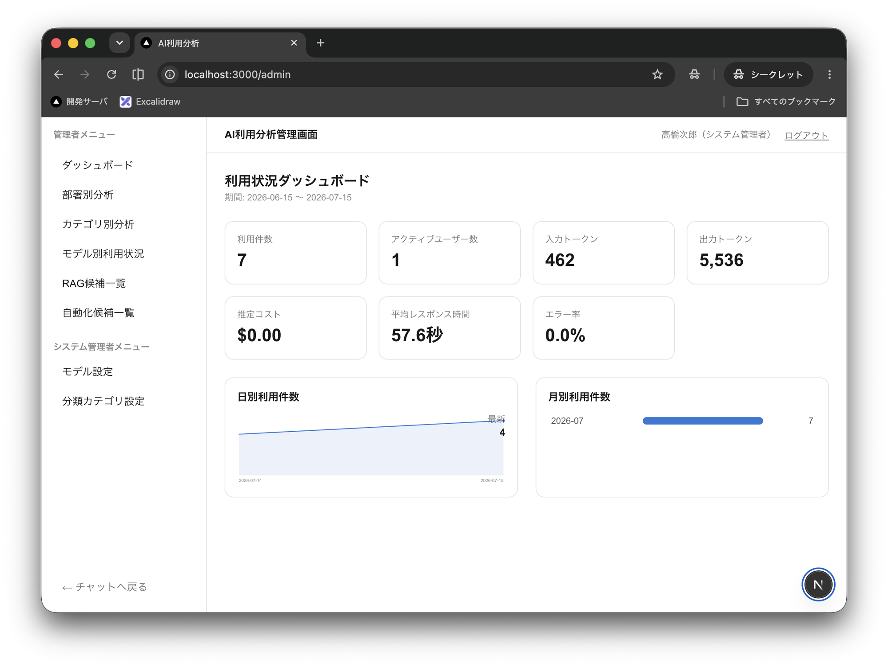

# AI Usalysis Demo

社内向けAI利用状況分析ツールのデモアプリケーションです。ローカルLLMを使ったチャット機能を提供しつつ、その裏側で「従業員がAIをどのように活用しているか」を自動分類・集計し、管理者向けダッシュボードで可視化します。

## 主な機能

- **チャット** — ローカルLLM(OpenAI互換API)とのストリーミングチャット。Markdown表示に対応
- **自動分類** — チャット内容を業務カテゴリ・利用目的・タスク種別・自動化可能性・RAG候補などにLLMが自動分類
- **マスキング** — メールアドレス・電話番号・APIキー等の機密情報を保存前に自動マスク
- **管理ダッシュボード** — 部署別・カテゴリ別・モデル別の利用状況、RAG化候補・自動化候補一覧をグラフで可視化
- **疑似ログイン** — パスワード不要のロールベース認証(一般ユーザー / 管理者 / システム管理者)

## スクリーンショット



## 技術スタック

- [Next.js](https://nextjs.org) 16 (App Router, Turbopack)
- React 19
- [Prisma](https://www.prisma.io) 7 + PostgreSQL
- [AI SDK](https://ai-sdk.dev) + OpenAI互換API(llama.cppなどのローカルLLM)
- Tailwind CSS 4

## セットアップ

### 前提

- Node.js 20.9以上
- Docker(PostgreSQL用)
- OpenAI互換APIを話すローカルLLMサーバー(例: [llama.cpp](https://github.com/ggml-org/llama.cpp)のserver機能)

### 手順

1. 依存関係をインストール

   ```bash
   npm install
   ```

2. 環境変数を設定

   ```bash
   cp .env.example .env
   ```

   `.env`の`SESSION_SECRET`は`openssl rand -hex 32`等で生成したランダムな値に変更してください。

3. PostgreSQLを起動

   ```bash
   docker compose up -d db
   ```

4. マイグレーションとシードデータを投入

   ```bash
   npx prisma migrate deploy
   npx prisma db seed
   ```

5. ローカルLLMサーバーを起動

   `.env`の`LLM_CHAT_BASE_URL` / `LLM_CLASSIFIER_BASE_URL`で指定したポートで、OpenAI互換APIを話すLLMサーバーを起動してください。

6. 開発サーバーを起動

   ```bash
   npm run dev
   ```

   [http://localhost:3000](http://localhost:3000) にアクセスし、疑似ログイン画面からユーザーを選択してください。

### バックグラウンドジョブ

チャット応答は送信時に自動で分類されますが、失敗時の再試行を行うワーカーと、日次集計バッチも用意されています。

```bash
npm run worker      # 分類の再試行ワーカー(常駐)
npm run aggregate   # 日次集計バッチ(前日分を集計)
```

## テスト・Lint

```bash
npm test    # vitest
npm run lint
```

## ライセンス

[MIT](LICENSE)
